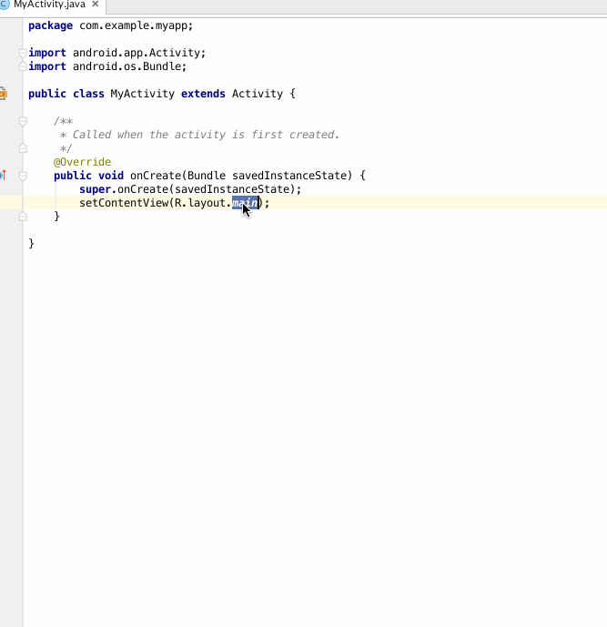

## FindViewByMe

A plugin for android developer, with the plugin you can generate "findViewById" code quickly.

 
### Download
[JetBrains Plugin Repository :: FindViewByMe](https://plugins.jetbrains.com/plugin/8261)

### Usage
 [使用简介：第一个插件FindViewByMe](http://laobie.github.io/android/2015/11/27/find-view-by-me.html)
 
### License

	Copyright 2015 Jaeger Chen

	Licensed under the Apache License, Version 2.0 (the "License");	you may not use this file except in compliance with the License.
	You may obtain a copy of the License at
	
		http://www.apache.org/licenses/LICENSE-2.0

	Unless required by applicable law or agreed to in writing, software
	distributed under the License is distributed on an "AS IS" BASIS,
	WITHOUT WARRANTIES OR CONDITIONS OF ANY KIND, either express or implied.
	See the License for the specific language governing permissions and
	limitations under the License.
